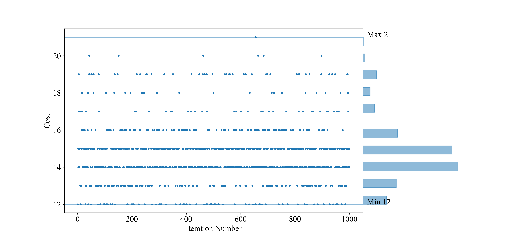
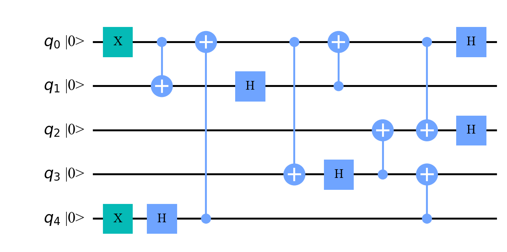

# Ancilla-Free-Preparation-of-Stabilizer-States

An algorithm for finding efficient, non-fault-tolerant, ancilla-free encoding circuits for stabilizer states.

1. [Introduction](#introduction)
2. [Theory overview](#theory)
3. [Example usage](#eg)

Below, I assume a basic familiarity with *quantum error correction* (on the level of [Roffe's review](https://arxiv.org/pdf/1907.11157))
and the *stabilizer formalism* (as discussed in [Chapter 5](https://arxiv.org/pdf/quant-ph/9705052) of Gottesman's thesis).
That is not to say an in-depth knowledge of these subjects is required to utilize the repository; the repository is accessible
to anyone with a generating set of stabilizers they want an encoding circuit for.

Note: This project is based on work from my undergraduate thesis at the University of Queensland, completed under the 
supervision of Dr. Terry Farrelly. Please contact me at [mdgorman@usc.edu](mailto:mdgorman@usc.edu) for citation information.

## Introduction <a name="introduction"></a>

Stabilizer states are widely used in quantum computing. It is often useful to prepare specific stabilizer states non-fault-tolerantly,
either for implementation on quantum devices or for simulation and research purposes.
Moreover, in both experimental and theoretical contexts, it is beneficial to have encoding circuits that are efficient - in the sense that they
require fewer gates and fewer ancilla qubits - as these more efficient encoding circuits generally consume fewer (quantum or classical) computational resources.

The most prominent algorithm for finding non-fault-tolerant, 
ancilla-free encoding circuits is due to [Cleve and Gottesman](https://arxiv.org/pdf/quant-ph/9607030). For CSS codes,
[Steane's](https://arxiv.org/pdf/quant-ph/0202036) add-on can reduce circuit depth, and [Paetznick's](https://arxiv.org/pdf/1410.5124)
method can reduces the gate count.
Another general approach for finding non-fault-tolerant, 
ancilla-free encoding circuits is due to [Wilde, Krovi, and Brun](https://arxiv.org/pdf/0708.3699).

While the Cleve-Gottesman method (with both Steane's and Paetznick's add-ons) is efficient for CSS codes, 
our algorithm is generally able to find significantly cheaper encoding circuits for non-CSS codes than the Cleve-Gottesman and Wilde-Krovi-Brun methods,
without incurring additional asymptotic (clasical) run-time cost.

Constructing encoding circuits - especially efficient ones - is typically laborious.
To the best of my knowledge, there are no publicly available packages implementing any algorithms 
for constructing encoding circuits.
This repository aims to help fill that gap.


## Theory overview <a name="theory"></a>

In this section, I introduce the basic idea behind the algorithm through a simple example. For a more rigorous 
justification of the algorithm’s correctness and performance, please feel free to contact me.

The algorithm begins with a set of stabilizer generators for the code. Suppose we have two such stabilizers: $XIZZ$ and $ZZZX$.
The algorithm selects one stabilizer to encode first. (The selection method is described later.) Let’s say it picks $XIZZ$. Say 
$XIZZ$ is chosen. The first step is to apply single-qubit gates—specifically Hadamard and phase gates—to convert all $X$
and $Y$ operators into $Z$s. Next, CNOTs are applied to remove all but one Pauli-$Z$. For instance, applying two CNOTs
(both targeting the first qubit and controlled on the third and fourth qubits respectively) propagating $ZIZZ$ to $ZIII$.
These gates are also applied to all the other stabilziers: $ZZZX$ here.

Since stabilizers must commute, the other generators must act with either identity or $Z$ on any qubit that has a $Z$ in
a weight-1 stabilizer. This means we can take products of generators to ensure the remaining stabilizers act trivially 
(with identity) on any such qubit. As a result, that qubit never needs gates applied to it again in subsequent steps, preventing 
unwanted propagation.
 
This process is repeated until every stabilizer has been mapped to a single-qubit $Z$ operator on a distinct qubit - consistent 
with the stabilizer group of a computational basis state. The resulting circuit is a unitary that maps the 
desired stabilizer state to that computational basis state. By taking the Hermitian conjugate of that unitary, we obtain the encoding 
circuit, completing the process.

To reduce gate overhead, we make the algorithm greedy. It is efficient to implement a cost function
for the number of gates needed to encode each stabilizer: count the number of each type of Pauli operator in the stabilizer.
In the earlier example, $XIZZ$ requires two Hadamards and two CNOTs, while $ZZZX$ requires one Hadamard and three CNOTs.
If Hadamards are considered cheaper, the algorithm will prefer $XIZZ$. In case of a tie in cost between stabilizers, one
is selected at random.

This locally optimized approach has been tested on a range of randomly selected codes and consistently produces 
significantly cheaper encoding circuits than the existing methods, particularly for non-CSS codes.

Finally, the algorithm also tracks the phases of stabilizers. If necessary, Pauli-$X$ gates are applied to correct signs. 
We’ve also implemented some optimizations to reduce the depth of the applied CNOT layers. There is still ample room for 
further improvement - please contact me if you're interested in contributing or extending this work.

## Example usage <a name="eg"></a>

In this section, I will show an example of how the package can be used to find an efficient circuit for encoding for 
the logical plus state of the five-qubit code. Begin by defining the state's stabilizers,

```python
import numpy as np

five_qubit_code_stabilizers = np.array([[0,1,3,3,1,0],
                                        [0,0,1,3,3,1],
                                        [0,1,0,1,3,3],
                                        [0,3,1,0,1,3]])

five_qubit_code_logical_X = np.array([[0,1,1,1,1,1]])
```

Here, the first column encodes the phase of each stabilizer, ```0``` for a +1 phase and ```2``` for a -1 phase.
The remaining columns represent the Pauli operator acting on each qubit: ```0```, ```1```, ```2```, and ```3``` represent 
the identity, Pauli-$X$, -$Y$, and -$Z$ respectively.
One can create a ```Code``` object as follows:

```python
fivequbit_code_X = Code(np.vstack((five_qubit_code_stabilizers, five_qubit_code_logical_X)))
```

Before procceding, it may be of interest to check that the stabilizers were correctly entered by using the ```read``` method:

```python
fivequbit_code_X.read()
```

Which, as expected, prints:

```
Stabilziers: 
+1 X Z Z X I 
+1 I X Z Z X 
+1 X I X Z Z 
+1 Z X I X Z 
+1 X X X X X 
```

Because the algorithm breaks equal-cost ties randomly, the cost of the encoding circuits can vary across runs.
The ```reduce_iterations``` method can be used to run multiple
trials and save the best result. For example:

```python
fivequbit_code_X.reduce_iterations("/Users/[INSERT PATH]/plot.png",1000,1,1,1)
fivequbit_code_X.circ_and_QASM(SAVE_PATH = "/Users/[INSERT PATH]/")
```

This will repeat the algorithm 1000 times to find the cheapest circuit it can when the cost of all three gates are equal.
The ```circ_and_QASM``` method saves the cheapest circuit information as a QASM file and draws the circuit diagram. The saved outputs
include the graph showing the distribution of the cost of the circuits produced over the 1000 iterations, highlighting the highest and lowest cost
circuits found,



And the saved image of one of the cheapest encoding circuits,




